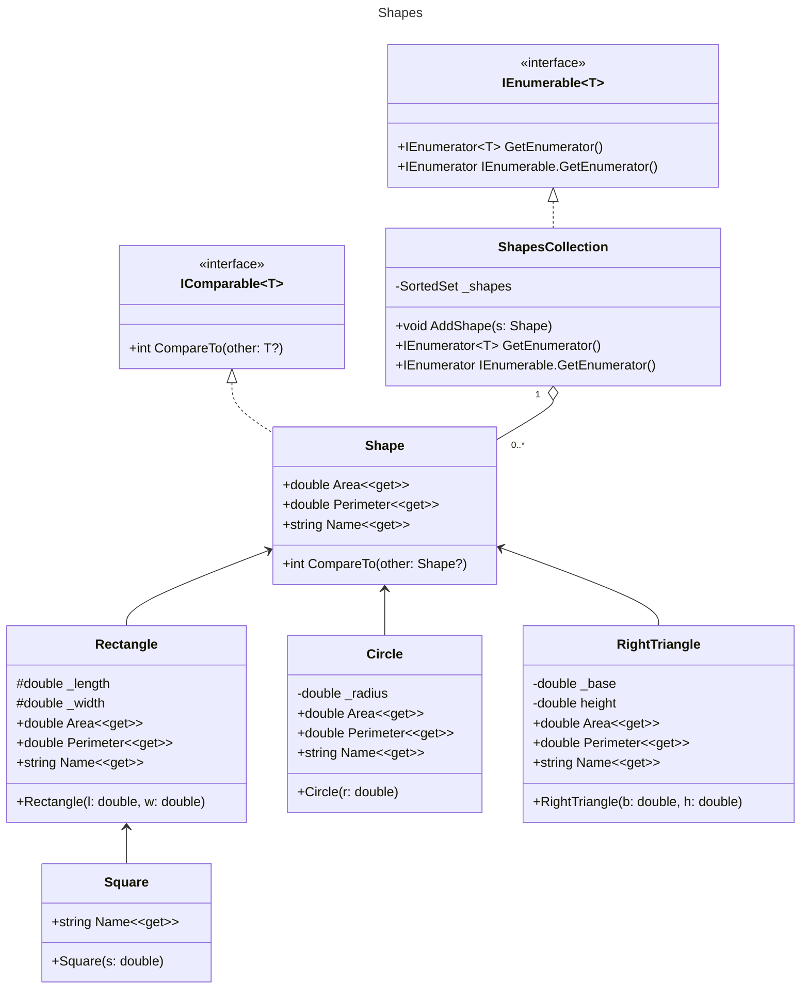

# test

```mermaid
---
title: Shapes
---
classDiagram
	class Shape {
		+double Area~~get~~
		+double Perimeter~~get~~
		+string Name~~get~~
		+int CompareTo(other: Shape?)
	}
	class Rectangle {
		#double _length
		#double _width
		+double Area~~get~~
		+double Perimeter~~get~~
		+string Name~~get~~
		+Rectangle(l: double, w: double)
	}
	class Circle {
		-double _radius
		+double Area~~get~~
		+double Perimeter~~get~~
		+string Name~~get~~
		+Circle(r: double)
	}
	class RightTriangle {
		-double _base
		-double height
		+double Area~~get~~
		+double Perimeter~~get~~
		+string Name~~get~~
		+RightTriangle(b: double, h: double)
	}
	class IComparable~T~ {
    <<interface>>
		+int CompareTo(other: T?)
	} 
	class IEnumerable~T~ {
    <<interface>>
		+IEnumerator~T~ GetEnumerator()
		+IEnumerator IEnumerable.GetEnumerator()
	}
	class ShapesCollection {
		-SortedSet<Shape> _shapes
		+void AddShape(s: Shape)
		+IEnumerator~T~ GetEnumerator()
		+IEnumerator IEnumerable.GetEnumerator()
	}
	class Square {
		+string Name~~get~~
		+Square(s: double)
	}
	IComparable <|.. Shape
	IEnumerable <|.. ShapesCollection
	ShapesCollection "1" o-- "0..*" Shape
	Shape <-- Rectangle
	Shape <-- Circle
	Shape <-- RightTriangle
	Rectangle <-- Square

```
